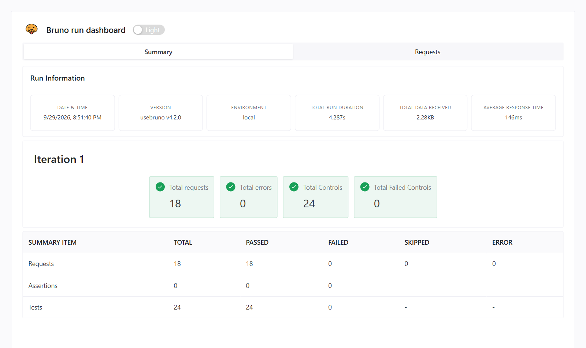
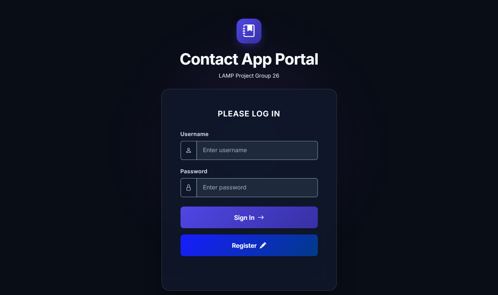
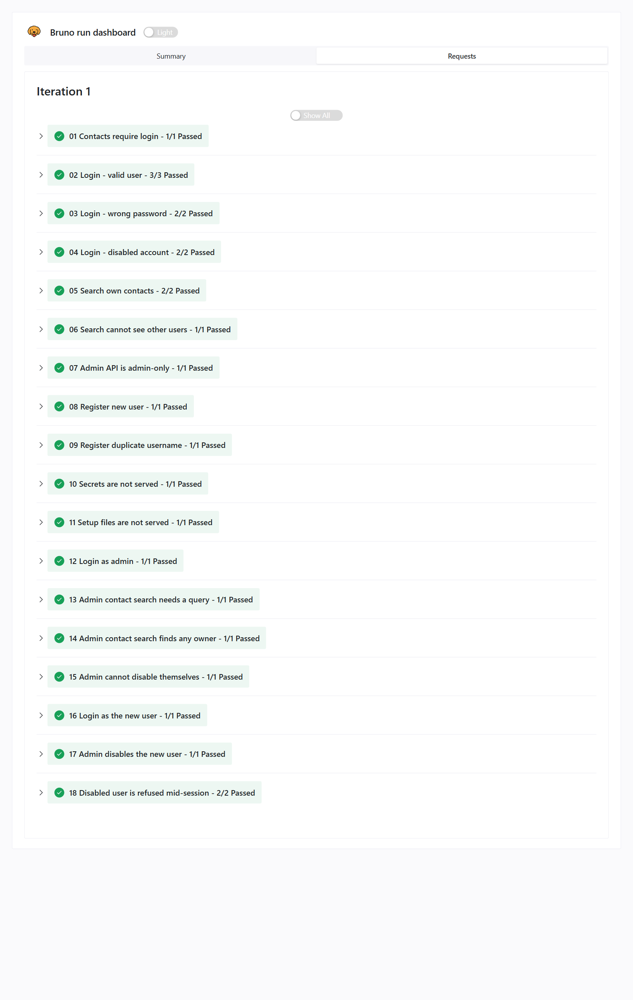
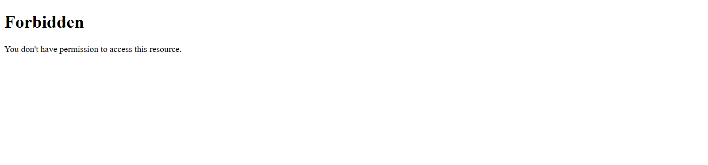

# API and Bruno testing

What we test, how, and what the API returns. Every example response below was captured
from the real app running locally on 2026-09-29.

**Latest results (2026-09-30)**

| Where | Requests | Tests | Result |
|---|---|---|---|
| Local Docker stack | 18 / 18 | 24 / 24 | ✅ Pass |
| Browser checks of the UI fixes (Playwright, local) | | 9 / 9 | ✅ Pass |
| Live site, credential-free requests (01, 03, 10, 11) | 4 / 4 | 5 / 5 | ✅ Pass (10 and 11 started passing once `.env` and `sql/` were moved off the web root) |
| GitHub Actions | | | Runs on every push; see the latest run on the pull request |



---

## 1. What Bruno is and why we use it

[Bruno](https://www.usebruno.com) is an API client, like Postman. You pick an endpoint,
enter the data to send, click **Send**, and see exactly what the server returns: the
status code, headers and JSON body. It skips the web page entirely and talks to the PHP
API directly.

Bruno saves each request as a small text file (`.bru`), so the whole collection lives in
this repo in the `bruno/` folder and the team shares it through git.

We use it for two things:

1. **The live API demo.** The project requires a live demonstration of the login endpoint
   in Bruno. Requests 02, 03 and 04 are that demo.
2. **Automated tests.** Every request file also says what the response *should* be. The
   same files run automatically, so if a change breaks login, search or access control,
   we find out before it reaches the live site.

The app under test is the Contact App Portal. Its sign-in page calls
`POST /api/login.php`, the same request Bruno sends in 02 to 04:



## 2. Where the tests run

| Where | When | Environment | Notes |
|---|---|---|---|
| Your computer, Bruno app | Whenever you want | `local` | Click **Run** on the collection, or send requests one by one |
| Your computer, command line | Whenever you want | `local` | `npx @usebruno/cli run --env local` |
| Pre-push check (this PC only) | Before every `git push` | `local`, pointed at `WEB_PORT` | Cancels the push if anything fails; lives in `.git/hooks/pre-push`, not in the repo |
| GitHub Actions | Every push and pull request | `ci` | Builds a fresh copy of the app with seed data, then runs the whole suite |
| Live site | Only for the demo | `production` | Run 01 to 07 and 10 to 11 only. **Never run 08, 09 or 12 to 18 on the live site**: they create accounts and disable one. |

## 3. Collection layout

```
bruno/
├── bruno.json                              collection settings
├── environments/
│   ├── local.bru                           baseUrl http://localhost:8081, seedPassword
│   ├── ci.bru                              same values, used by GitHub Actions
│   └── production.bru                      baseUrl https://lamp.finnick.party, seedPassword is a secret you type in
├── 01 Contacts require login.bru
├── 02 Login - valid user.bru
├── 03 Login - wrong password.bru
├── 04 Login - disabled account.bru
├── 05 Search own contacts.bru
├── 06 Search cannot see other users.bru
├── 07 Admin API is admin-only.bru
├── 08 Register new user.bru
├── 09 Register duplicate username.bru
├── 10 Secrets are not served.bru
├── 11 Setup files are not served.bru
├── 12 Login as admin.bru
├── 13 Admin contact search needs a query.bru
├── 14 Admin contact search finds any owner.bru
├── 15 Admin cannot disable themselves.bru
├── 16 Login as the new user.bru
├── 17 Admin disables the new user.bru
└── 18 Disabled user is refused mid-session.bru
```

Requests run in number order, and the order matters: 01 must run before anyone logs in,
05 to 07 reuse the login from 02, and 12 to 18 use the admin login from 12 and the account
created in 08.

**Variables**

| Variable | Set by | Used by | Meaning |
|---|---|---|---|
| `baseUrl` | Environment file | Every request | Where the app is, such as `http://localhost:8081` |
| `seedPassword` | Environment file (a secret in `production`) | 02, 04, 08, 09 | The shared password of the non-root seed accounts in `sql/seed.sql` |
| `sessionCookie` | Script in request 02 | 05, 06, 07 | Alice's PHP session cookie (`PHPSESSID=…`) |
| `newUsername`, `newUserId` | Script in request 08 | 08, 09, 16, 17 | The account 08 creates, such as `ci_1790724603` |
| `rootPassword` | Environment file (a secret in `production`) | 12 | The seed password of `root` in `sql/seed.sql` |
| `adminCookie`, `adminId` | Script in request 12 | 13, 14, 15, 17 | Root's session cookie and user id |
| `newUserCookie` | Script in request 16 | 18 | The new account's session cookie |

## 4. Running the tests

### In the Bruno app

1. Install Bruno from [usebruno.com](https://www.usebruno.com).
2. **Open Collection** and choose the `bruno/` folder of this repo.
3. Pick an environment in the top-right corner (`local` for your Docker stack).
4. Click a request and press **Send**. The **Tests** tab shows each check as passed or
   failed.
5. To run everything, right-click the collection and choose **Run**.

If your local `.env` sets `WEB_PORT` to something other than 8081, edit `baseUrl` in the
`local` environment to match.

### From the command line

```bash
cp .env.example .env          # first time only; set DB_PASSWORD
docker compose up -d          # starts Apache + PHP 8.2 + MySQL with the seed data
cd bruno
npx @usebruno/cli run --env local --disable-cookies
```

`--disable-cookies` matters. By default the CLI keeps a cookie jar and sends the most
recent login's cookie with every request, which breaks 17 and 18: they need the admin and
the new user logged in at the same time. In the Bruno app, turn off automatic cookies in
**Preferences** before running the whole collection.

Point it somewhere else without editing files:

```bash
npx @usebruno/cli run --env local --disable-cookies --env-var baseUrl=http://localhost:8050
```

Run a single request:

```bash
npx @usebruno/cli run "03 Login - wrong password.bru" --env local
```

Save a clickable HTML report of the run (the screenshots on this page come from one):

```bash
npx @usebruno/cli run --env local --reporter-html results.html
```

### Resetting the local data

Requests 08 and 09 add a new `ci_…` user on every run, and manual testing changes data.
To go back to the original seed data:

```bash
docker compose down -v
docker compose up -d
```

### In GitHub Actions

`.github/workflows/ci-cd.yml` runs on every push and pull request:

1. `php -l` on every PHP file.
2. `cp .env.example .env`, then `docker compose up -d --build`: a brand-new database is
   built from `sql/schema.sql` and `sql/seed.sql`.
3. Waits until `POST /api/login.php` answers.
4. `npx @usebruno/cli run --env ci --disable-cookies`.
5. On failure, prints the container logs.

A red ❌ on a pull request means one of these steps failed. Open the run's logs to see
which request and which check.

## 5. Test data

The seed data (`sql/seed.sql`) creates these accounts. Every account except `root` uses
the same password, which the collection calls `seedPassword`. Both passwords are listed
in the comments at the top of `sql/seed.sql`.

| Username | Full name | Role | Status | Contacts |
|---|---|---|---|---|
| `root` | Application Administrator | admin | Active | 0 |
| `admin2` | Morgan Admin | admin | Active | 0 |
| `alice` | Alice Johnson | user | Active | 5: Brian Smith, Bria Lopez, Samantha Brown, Dr. Patel, Mom |
| `bob` | Bob Martinez | user | Active | 3: Brian Smith, Kevin Tran, Laura Chen |
| `carol` | Carol Nguyen | user | Active | 2: Pizza Palace, Jordan Rivera |
| `dave` | Dave Disabled | user | **Disabled** | 1: Old Friend |

The data is built to catch mistakes: Alice and Bob both have a contact named
"Brian Smith", so a search that leaks across users would show up, and Dave is disabled
from the start.

## 6. The test suite, request by request

Every response has `"success": true` or `false`. Errors always look like
`{"success": false, "error": "…"}`.



### 01 · Contacts require login

Proves the contacts API refuses anyone who isn't logged in.

```http
GET {{baseUrl}}/api/contacts_list.php?q=bri
```

No cookie is sent. Response: **401**

```json
{ "success": false, "error": "Not authenticated" }
```

| Check | Expected |
|---|---|
| no session: 401 | status is 401 |

### 02 · Login, valid user

The main demo request. Logs in as Alice and keeps her session for requests 05 to 07.

```http
POST {{baseUrl}}/api/login.php
Content-Type: application/json

{ "username": "alice", "password": "{{seedPassword}}" }
```

Response: **200**, plus a `Set-Cookie: PHPSESSID=…` header

```json
{
  "success": true,
  "user_id": 3,
  "username": "alice",
  "full_name": "Alice Johnson",
  "role": "user"
}
```

A post-response script saves the last `PHPSESSID` cookie into `sessionCookie`. PHP issues
a fresh session ID at login (`session_regenerate_id`), so the last cookie is the valid one.

| Check | Expected |
|---|---|
| 200 OK | status is 200 |
| returns the user's role | `role` is `"user"`; the web page uses it to choose the admin or contacts page |
| sets a session cookie | `sessionCookie` starts with `PHPSESSID=` |

### 03 · Login, wrong password

```http
POST {{baseUrl}}/api/login.php

{ "username": "alice", "password": "wrong-password" }
```

Response: **401**

```json
{ "success": false, "error": "Invalid username or password" }
```

| Check | Expected |
|---|---|
| 401 Unauthorized | status is 401 |
| generic message that doesn't reveal which field was wrong | error is exactly `"Invalid username or password"`, the same for an unknown username, so attackers can't find valid usernames |

### 04 · Login, disabled account

```http
POST {{baseUrl}}/api/login.php

{ "username": "dave", "password": "{{seedPassword}}" }
```

Response: **403**

```json
{ "success": false, "error": "Account disabled. Contact an administrator." }
```

| Check | Expected |
|---|---|
| 403 Forbidden | status is 403 |
| explains the account is disabled | error contains `"disabled"` |

The password is correct: Dave is refused only because an admin disabled him.

### 05 · Search own contacts

Proves search runs as an API call with a SQL query and matches partial text.

```http
GET {{baseUrl}}/api/contacts_list.php?q=bri
Cookie: {{sessionCookie}}
```

Response: **200**

```json
{
  "success": true,
  "query": "bri",
  "contacts": [
    { "id": 2, "name": "Bria Lopez", "phone": "407-555-0102", "email": "bria.lopez@example.com",
      "address": "22 Oak Ave, Orlando, FL", "notes": "Study group", "created_at": "…", "updated_at": "…" },
    { "id": 1, "name": "Brian Smith", "phone": "407-555-0101", "email": "brian.smith@example.com",
      "address": "100 Main St, Orlando, FL", "notes": "Coworker", "created_at": "…", "updated_at": "…" }
  ]
}
```

| Check | Expected |
|---|---|
| 200 OK | status is 200 |
| partial match finds Brian and Bria | names are exactly `["Bria Lopez", "Brian Smith"]`. Bob's "Brian Smith" is **not** included. |

### 06 · Search cannot see other users

```http
GET {{baseUrl}}/api/contacts_list.php?q=Kevin
Cookie: {{sessionCookie}}
```

"Kevin Tran" belongs to Bob. Response: **200** with an empty list

```json
{ "success": true, "query": "Kevin", "contacts": [] }
```

| Check | Expected |
|---|---|
| Bob's contact is invisible to Alice | status 200 and `contacts` is empty |

Every contact query includes `AND user_id = ?` for the logged-in user, so one user can't
see another's contacts.

### 07 · Admin API is admin-only

```http
GET {{baseUrl}}/api/admin_users_list.php
Cookie: {{sessionCookie}}
```

Alice is logged in but isn't an admin. Response: **403**

```json
{ "success": false, "error": "Admin access required" }
```

| Check | Expected |
|---|---|
| a regular user gets 403 | status is 403 |

### 08 · Register new user

```http
POST {{baseUrl}}/api/register.php

{ "username": "{{newUsername}}", "password": "{{seedPassword}}", "full_name": "CI Test User" }
```

A pre-request script sets `newUsername` to `ci_` plus the current time, so every run
registers a new name. Response: **201**

```json
{ "success": true, "user_id": 15, "username": "ci_1790724603", "full_name": "CI Test User", "role": "user" }
```

| Check | Expected |
|---|---|
| 201 Created | status is 201 |

### 09 · Register duplicate username

Sends the same username as 08 again. Response: **409**

```json
{ "success": false, "error": "Username already exists" }
```

| Check | Expected |
|---|---|
| 409 Conflict | status is 409 |

### 10 · Secrets are not served

```http
GET {{baseUrl}}/.env
```

| Check | Expected |
|---|---|
| .env is blocked (403) or missing (404) | status is 403 or 404, never 200 |

Locally, `apache/lamp-security.conf` blocks it with **403**. On the droplet `.env` belongs
one folder above the web root (`/var/www/.env`), where it can't be reached at all.



### 11 · Setup files are not served

```http
GET {{baseUrl}}/sql/seed.sql
```

| Check | Expected |
|---|---|
| seed file with test passwords is blocked (403) or missing (404) | status is 403 or 404 |

`sql/seed.sql` lists the default passwords, including root's, so it must never be
downloadable from the site.

### 12 to 18 · Admin rules and instant suspension

These run as `root` and use the account created in 08, so they never touch the seed users.

| # | Request | Expected |
|---|---|---|
| 12 | `POST /api/login.php` as `root` | **200**, `role` is `"admin"`; saves `adminCookie` and `adminId` |
| 13 | `GET /api/admin_contacts_list.php?q=` | **200** with an empty `contacts` list: contacts are search-only, never all at once |
| 14 | `GET /api/admin_contacts_list.php?q=pizza` | **200** with exactly one contact, Pizza Palace, owned by `carol` |
| 15 | `PUT /api/admin_disable_user.php` with root's own id | **400** `"You can't disable your own account"` |
| 16 | `POST /api/login.php` as the account from 08 | **200**; saves `newUserCookie` |
| 17 | `PUT /api/admin_disable_user.php` for that account | **200**, `is_disabled` is `true` |
| 18 | `GET /api/me.php` with the new account's still-open session | **403** with `"code": "account_disabled"` |

18 is the feature from our presentation: the user is still logged in, an admin disables them,
and their very next request is refused. The web page reads the `account_disabled` code and
sends them to the login page with *"Your account has been disabled. Contact an
administrator."*

## 7. Full API reference

Base path: `/api/`. Every endpoint takes and returns JSON
(`Content-Type: application/json`). Logging in sets a PHP session cookie (`PHPSESSID`);
send it back on later requests. In the browser, `fetch(…, { credentials: "same-origin" })`
does this automatically.

**Status codes**

| Code | Meaning |
|---|---|
| 200 | OK |
| 201 | Created |
| 400 | Bad input: invalid JSON, a missing field, or a failed validation |
| 401 | Not logged in, or wrong username or password |
| 403 | Logged in but not allowed: a disabled account, or a non-admin calling an admin endpoint |
| 404 | Not found, including a contact that belongs to someone else |
| 405 | Wrong HTTP method, such as `GET` on `login.php` |
| 409 | Duplicate username |
| 500 | Server or database error (the details go to the server log, never to the browser) |

**Access checks.** Every endpoint except `register`, `login` and `logout` calls
`requireLogin()` first. It re-reads the user from MySQL on **every** request, so an
account an admin disables is refused on its very next request, even mid-session. That
response is `403` with `"code": "account_disabled"`, which tells the web page to send
the user back to the login page with an explanation. The five
`admin_*` endpoints call `requireAdmin()`, which adds a role check.

"In suite" marks what the Bruno collection checks automatically. "Verified manually"
means the example was captured by hand on 2026-09-29 but isn't automated yet.

### Auth

#### `POST /api/register.php`: create a user account · in suite (08, 09)

| Field | Rules |
|---|---|
| `username` | Required, 3 to 50 characters, unique |
| `password` | Required, at least 8 characters, stored as a bcrypt hash |
| `full_name` | Required |

`201` → `{ "success": true, "user_id": 15, "username": "…", "full_name": "…", "role": "user" }`

Errors: `400` missing field, username length, or `"Password must be at least 8 characters"`
· `409` `"Username already exists"`. New accounts always get the `user` role.

#### `POST /api/login.php`: log in · in suite (02, 03, 04)

Body: `{ "username": "…", "password": "…" }`. Only the username works; the email address
isn't accepted.

`200` → `{ "success": true, "user_id": 3, "username": "alice", "full_name": "Alice Johnson", "role": "user" }` plus a new session cookie

Errors: `400` `"Username and password are required"` · `401` `"Invalid username or password"` ·
`403` `"Account disabled. Contact an administrator."` · `405` if not `POST`.

#### `POST /api/logout.php`: end the session · verified manually

No body. `200` → `{ "success": true }`. The session is destroyed and the cookie
expired, so `me.php` then returns `401`.

#### `GET /api/me.php`: who is logged in · verified manually

`200` → `{ "success": true, "user": { "id": 3, "username": "alice", "full_name": "Alice Johnson", "role": "user" } }`

Errors: `401` not logged in · `403` account disabled. The contacts and admin pages call
it on load to show "Logged in as …".

### Contacts (logged-in user, own contacts only)

#### `GET /api/contacts_list.php?q=<text>`: search · in suite (01, 05, 06)

Matches `q` anywhere in name, phone, email, address or notes, for the logged-in user's
contacts only. Results are sorted by name, at most 50.

`200` → `{ "success": true, "query": "bri", "contacts": [ … ] }`. An empty `q`
returns an empty list; the API never returns everything at once.

Errors: `401` not logged in · `403` disabled.

#### `POST /api/contacts_create.php`: add a contact · verified manually

| Field | Rules |
|---|---|
| `name` | Required, up to 100 characters |
| `phone` | Optional, up to 30 characters |
| `email` | Optional, up to 255 characters, must be a valid email |
| `address` | Optional, up to 255 characters |
| `notes` | Optional |

`201` →

```json
{
  "success": true,
  "message": "Contact created successfully",
  "contact": { "id": 12, "name": "Test Contact", "phone": "407-555-0199",
               "email": "test@example.com", "address": "", "notes": "created by docs run" }
}
```

Errors: `400` `"Contact name is required"`, `"Invalid email address"` or a length message.

#### `PUT /api/contacts_update.php`: edit a contact · verified manually

Body: `{ "id": 12, "name": "…", "phone": "…", "email": "…", "address": "…", "notes": "…" }`.
The same rules as create; `id` can't be changed.

`200` → `{ "success": true, "message": "Contact updated successfully", "contact": { … } }`

Errors: `400` validation · `404` `"Contact not found"`, **also returned for another user's
contact**, so an ID that belongs to someone else can't be edited.

> **Send every field.** The update replaces the whole contact: a field left out is saved
> as empty. The web page always sends all fields, so the app behaves correctly, but
> `API_contract.txt` lists these fields as optional.

#### `DELETE /api/contacts_delete.php`: delete a contact · verified manually

Body: `{ "id": 12 }`. `200` → `{ "success": true, "message": "Contact deleted successfully" }`

Errors: `400` missing `id` · `404` `"Contact not found"`, also returned for another user's
contact.

### Admin (admins only; everyone else gets `403 "Admin access required"`)

#### `GET /api/admin_users_list.php?q=<text>`: list and search users · 403 case in suite (07)

Searches username, full name, email and role. An empty `q` lists users alphabetically,
up to 100. Each user includes a contact count.

```json
{
  "success": true,
  "query": "alice",
  "users": [
    { "id": 3, "username": "alice", "full_name": "Alice Johnson", "email": "alice@example.com",
      "role": "user", "is_disabled": false, "created_at": "…", "contact_count": 5 }
  ]
}
```

#### `GET /api/admin_contacts_list.php?q=<text>`: search every user's contacts · in suite (13, 14)

Searches every contact field plus the owner's username and full name. Each result
includes the owner.

```json
{
  "success": true,
  "query": "pizza",
  "contacts": [
    { "id": 9, "user_id": 5, "username": "carol", "owner_name": "Carol Nguyen", "name": "Pizza Palace",
      "phone": "407-555-0301", "email": null, "address": "400 University Blvd, Orlando",
      "notes": "Order #2 is the good one", "created_at": "…", "updated_at": "…" }
  ]
}
```

An empty `q` returns an empty list. Contacts are search-only, as the project requires, and
the admin page waits for a search before showing any. At most 100 results.

#### `PUT /api/admin_disable_user.php`: disable or re-enable a user · in suite (15, 17, 18)

Body: `{ "user_id": 15, "is_disabled": true }` (or `false` to re-enable). Works on admins
too. Users are never deleted.

`200` → `{ "success": true, "message": "User disabled successfully", "user": { "id": 15, "username": "…", "role": "user", "is_disabled": true } }`

Verified: the disabled user's **very next request** returned
`403 "Account disabled. Contact an administrator."` without logging in again.

Errors: `400` invalid `user_id` or `is_disabled`, or `"You can't disable your own account"` ·
`404` `"User not found"`. The admin page also greys out the Disable button on your own row.

#### `PUT /api/admin_change_password.php`: set a user's password · verified manually

Body: `{ "user_id": 15, "new_password": "…" }` (at least 8 characters).

`200` → `{ "success": true, "message": "Password changed successfully", "user": { "id": 15, "username": "…" } }`

Verified: the user could then log in with the new password. This also clears
`must_change_password`.

#### `POST /api/admin_create_user.php`: create a user or admin · verified manually

Body: `{ "username": "…", "password": "…", "full_name": "…", "role": "admin" }`. `role`
must be `"user"` or `"admin"`.

`201` → `{ "success": true, "message": "User created successfully", "user": { "id": 17, "username": "…", "full_name": "Doc Admin", "role": "admin", "is_disabled": false } }`

Errors: `400` `"Role must be admin or user"` or other validation · `409` duplicate
username.

## 8. Requirements coverage

| Project requirement | How it's verified |
|---|---|
| Users log in and see only their own contacts | Bruno 02, 05, 06 |
| Search runs as an API call and SQL query, never loading everything | Bruno 05 (users), 13 and 14 (admin) |
| Partial search | Bruno 05 ("bri" finds Bria and Brian) |
| Register a new account | Bruno 08, 09 |
| Disabled users can't log in, with a clear message | Bruno 04 |
| Admin features are admin-only | Bruno 07 |
| Add, edit and delete contacts; can't touch other users' contacts | Verified manually (section 7) |
| Admin disables a user, who is refused mid-session | Bruno 16, 17, 18; browser check of the redirect |
| Admin changes a password, and the user logs in with it | Verified manually |
| An admin can't lock themselves out | Bruno 15; browser check of the greyed-out button |
| Admin creates other admins | Verified manually |
| Passwords hashed and salted | Code review: `password_hash()` / bcrypt |
| HTTPS on a domain name | Live site: valid Let's Encrypt certificate, HTTP redirects to HTTPS |
| Secrets and setup files not downloadable | Bruno 10, 11 (pass locally; fail on the live site until the droplet setup is done) |

## 9. Known gaps and next tests

- **Not automated yet:** contact create, update and delete; admin change password and
  create admin. Each works when checked by hand.
- `contacts_update` clears fields that aren't sent (section 7).
- `login.php` accepts only the username, while `API_contract.txt` says username or email.

**Security findings from probing the local stack (2026-09-29), not fixed yet:**

| Finding | Risk | Suggested fix |
|---|---|---|
| The session cookie has no `HttpOnly`, `Secure` or `SameSite` flag | Page scripts can read it; it isn't limited to HTTPS | Set the flags with `session_set_cookie_params()` before every `session_start()` |
| `logout.php` accepts any method, including a plain `GET` | Another site can log users out with a hidden image | Require `POST` |
| No `X-Frame-Options`, `Content-Security-Policy` or `X-Content-Type-Options` headers | The admin dashboard could be framed by another site and clicked through | Add the headers to `apache/lamp-security.conf` |
| A field sent as the wrong type (for example `"name": ["x"]`) crashes PHP | Locally the error and file paths are printed; the live site returns a bare 500 | Check `is_string()` before `trim()`, and keep `display_errors` off |
| No limit on login attempts | Passwords can be guessed without slowing down | Count failures per user or IP and pause after a few |
| Usernames accept spaces and HTML | Displayed safely as text, but untidy | Allow only letters, digits, `.`, `_` and `-` |

## 10. Troubleshooting

| Problem | Fix |
|---|---|
| Every request fails with a connection error | The stack isn't running: `docker compose up -d`. Check the port matches `WEB_PORT` in `.env`. |
| `required variable DB_PASSWORD is missing a value` | `cp .env.example .env` and set `DB_PASSWORD` |
| `500 "Server is not configured"` | PHP can't find the database password: check `.env` (locally) or `/var/www/.env` (droplet) |
| `500 "DB connection failed"` | The password in `.env` doesn't match MySQL. Locally, `docker compose down -v` rebuilds the database with the password in `.env`. |
| 05 or 06 fail with 401 | 02 didn't run first, or its login failed; run the whole collection in order |
| 17 fails with 403 "Admin access required", or 18 gets 200 | The cookie jar sent the wrong login: add `--disable-cookies`, or turn off automatic cookies in the Bruno app |
| 05 finds extra contacts | Local data changed by manual testing: `docker compose down -v` |
| 10 or 11 fail on the live site | The droplet still serves those files; follow `docs/deploy.md` steps 2 and 3 |
| `git push` says "push cancelled" | The pre-push check found a problem; read the lines above it. Skip once with `git push --no-verify`. |

## 11. Live demo checklist

1. Open the `bruno/` collection and pick **production**.
2. Enter `seedPassword` in the environment (it's a secret, so it isn't saved in the repo).
3. Before presenting, run 02, 03 and 04 once, and make the font large enough for the room.
4. During the demo, send 02 (200 plus role), then 03 (401), then 04 (403), and show the
   **Tests** tab each time.
5. Don't run 08 or 09 against the live site.
