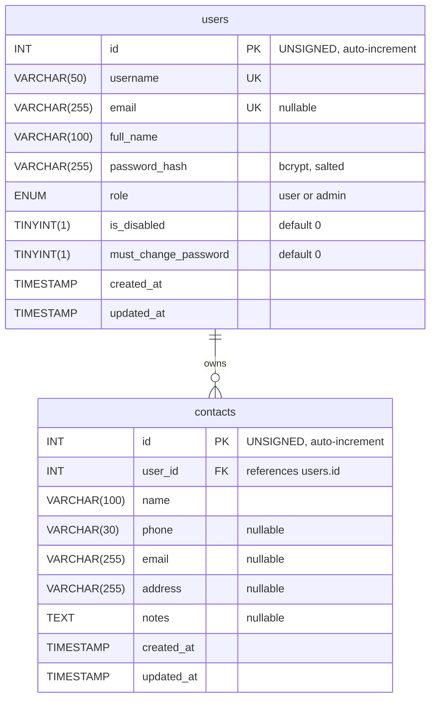
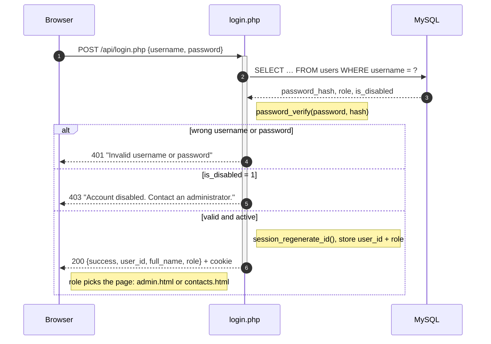
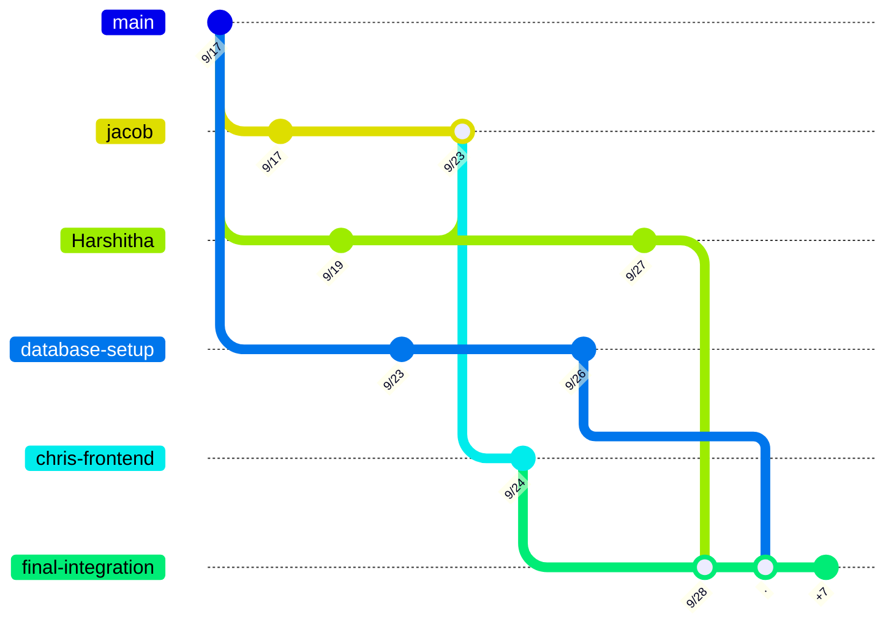

# Diagrams

Mermaid sources for the diagrams in our presentation. GitHub renders these
automatically; edit the code blocks to update them.

## Entity-relationship diagram

Matches [`sql/schema.sql`](../sql/schema.sql). A user owns zero or many
contacts; the foreign key is `ON DELETE RESTRICT`, so users are disabled,
never deleted.

## Login sequence

Matches [`api/login.php`](../api/login.php).

## Branch history

Simplified from `git log --graph` (branch-test commits omitted). Four
workstreams ran in parallel and were merged into `final-integration` on 9/28.

